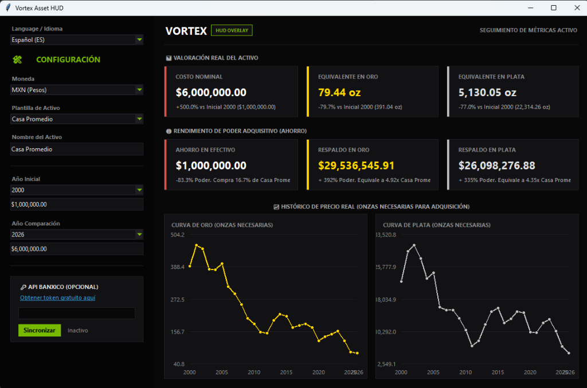

# Vortex Asset HUD


[](https://github.com/adenimoc/Vortex)
[](https://www.python.org/)
[](LICENSE)

## 📸 Vista Previa / Preview



*Vortex Asset HUD* es una aplicación de escritorio premium desarrollada en Python (Tkinter/Ttk) diseñada para medir la pérdida de poder adquisitivo del dinero fiat mediante el contraste del costo real de activos históricos y actuales contra el precio del Oro y la Plata.

*Vortex Asset HUD* is a premium Python desktop application (built with Tkinter/Ttk) designed to measure fiat currency devaluation by comparing the real historical and current cost of any asset against the price of Gold and Silver.

---

## 📖 Tabla de Contenido / Table of Contents
1. [Características / Features](#-características--features)
2. [Guía del Usuario / User Guide](#-guía-del-usuario--user-guide)
   * [Configuración de Moneda e Idioma](#configuración-de-moneda-e-idioma)
   * [Uso de Plantillas (Presets)](#uso-de-plantillas-presets)
   * [API de Banxico](#sincronización-con-la-api-de-banxico)
   * [Interpretación del HUD de Métricas](#interpretación-del-hud-de-métricas)
   * [Gráficos Interactivos](#gráficos-interactivos)
3. [Instalación y Uso / Installation & Usage](#-instalación-y-uso--installation--usage)
4. [Licencia / License](#-licencia--license)

---

## 🌟 Características / Features

### 🇪🇸 Español
* **Diseño Premium Cyberpunk:** Interfaz de usuario oscura estilizada con acentos de color neon para una visualización clara y moderna.
* **Multibilingüe Dinámico:** Selector integrado para alternar toda la interfaz entre Español e Inglés en tiempo real.
* **Cálculos de Inflación Real:** Compara el costo nominal de activos contra su valor real medido en onzas de metales preciosos.
* **Gráficos en Canvas Interactivos:** Dos visualizadores independientes dibujados en Canvas con cursor vertical de seguimiento de ratón y caja de tooltip flotante con los datos exactos.
* **Concurrencia en Red (Multithreading):** Las consultas de cotizaciones dinámicas (Yahoo Finance/Banxico) se realizan en segundo plano, evitando que la app se bloquee.
* **Banxico API Integrado:** Permite registrar tu token del Banco de México para obtener el tipo de cambio FIX oficial del día, guardándolo de forma segura en un archivo `config.json` local.

### 🇬🇧 English
* **Premium Cyberpunk Design:** Dark themed user interface with glowing neon accents for clean, high-contrast metrics tracking.
* **Dynamic Multilingual Support:** Seamless real-time translation toggle between English and Spanish.
* **Real Inflation Engine:** Compares the nominal cost of assets against their real value measured in ounces of Gold and Silver.
* **Interactive Canvas Charts:** Dual custom-drawn canvas charts featuring mouse-tracking vertical cursors and floating hover tooltips.
* **Asynchronous Data Loading (Multithreading):** Background API calls (Yahoo Finance/Banxico) keep the interface smooth and responsive.
* **Banxico API Integration:** Key entry for Mexico's Central Bank official FIX exchange rate, saved securely in a local `config.json` configuration file.

---

## 📘 Guía del Usuario / User Guide

### Configuración de Moneda e Idioma
1. **Language / Idioma:** Usa el selector superior para cambiar la aplicación a inglés o español. Tus cambios se guardarán automáticamente para futuras ejecuciones.
2. **Moneda / Currency:** Selecciona **MXN (Pesos)** o **USD (Dólares)**. Toda la aplicación reajustará las fórmulas y montos en base a la divisa seleccionada.

### Uso de Plantillas (Presets)
El HUD incluye plantillas preestablecidas de activos históricos (Casa Promedio, Auto Nuevo, iPhone, Leche, Huevo) desde el año 2000 al 2026. Al seleccionar un preset, la aplicación carga automáticamente los precios nominales promedio registrados para dichos años. Para ingresar tus propios datos, selecciona la plantilla **Personalizado / Custom**.

### Sincronización con la API de Banxico
Para obtener el tipo de cambio oficial de liquidación (FIX) de México en tiempo real:
1. Haz clic en el enlace azul **"Obtener token gratuito aquí"** del panel. Esto abrirá tu navegador para solicitar tu clave gratuita del Banco de México.
2. Pega tu token en el campo de texto (los caracteres se ocultarán).
3. Presiona el botón **Sincronizar**. Si el token es correcto, el estado cambiará a **"Sincronizado"** y el tipo de cambio actual se actualizará. Para volver al modo Yahoo Finance o base de datos estática, borra el campo del token y vuelve a presionar Sincronizar.

### Interpretación del HUD de Métricas
El tablero de la derecha despliega dos filas de tarjetas con códigos de color de advertencia/seguridad:
* **Costo Nominal:** El precio de compra del activo. El porcentaje muestra el incremento de la inflación en dinero fiat (generalmente muy alto).
* **Equivalente en Oro/Plata:** Muestra cuántas onzas de metal requieres para adquirir el activo hoy en comparación con el año inicial. Si el porcentaje es negativo (color verde), significa que el activo se ha vuelto *más barato* en términos de valor real (metales).
* **Ahorro en Efectivo:** Demuestra la devaluación extrema. Si hubieras guardado el dinero equivalente al costo inicial en efectivo, hoy solo podrías comprar una fracción mínima del activo (ej. solo el 15% de una casa).
* **Respaldo en Oro/Plata:** Muestra el rendimiento de tu poder adquisitivo si hubieras guardado ese ahorro respaldado en onzas físicas de metales. Los porcentajes verdes representan la ganancia de poder adquisitivo neto.

### Gráficos Interactivos
Mueve tu ratón sobre los dos gráficos inferiores. Un cursor vertical de color verde NVIDIA se desplazará detectando los años intermedios, mostrándote una burbuja con las onzas exactas requeridas para cada año.

---

## 💻 Instalación y Uso / Installation & Usage

### 🪟 Windows (Ejecución Rápida / Quick Start)
La forma más fácil de ejecutar el programa es abrir la carpeta del proyecto y hacer doble clic en el archivo:
```text
run.bat
```
Este script validará la existencia de Python, instalará las dependencias necesarias de forma silenciosa e iniciará el HUD de escritorio.

### 🍏 macOS / 🐧 Linux
1. Abre tu terminal de comandos en el directorio del proyecto.
2. Instala la dependencia gráfica de Tkinter (en caso de que tu sistema operativo no la incluya por defecto):
   * **macOS (si usas Homebrew):** `brew install python-tk`
   * **Linux (Debian/Ubuntu):** `sudo apt-get install python3-tk`
   * **Linux (Fedora):** `sudo dnf install python3-tkinter`
3. Instala la librería HTTP `requests`:
   ```bash
   pip install -r requirements.txt
   ```
4. Ejecuta la aplicación de escritorio:
   ```bash
   python3 app.py
   ```

---

## 📄 Licencia / License

Este proyecto se distribuye bajo la licencia de código abierto **MIT**. Siéntete libre de modificarlo, distribuirlo y utilizarlo en proyectos personales o comerciales. Consulta el archivo [LICENSE](LICENSE) para más detalles.

---

## 👥 Colaboradores / Contributors

* **Vortex Team** - *Diseño y desarrollo original.*
